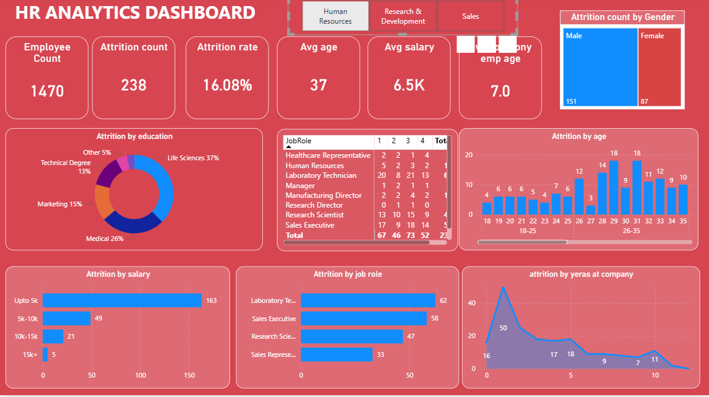
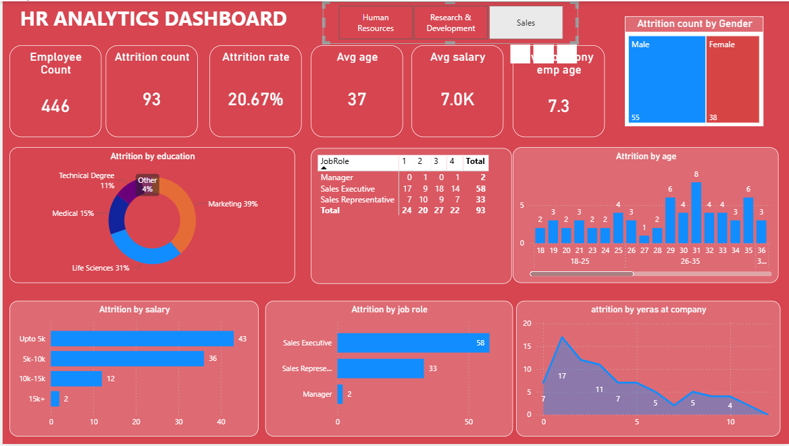
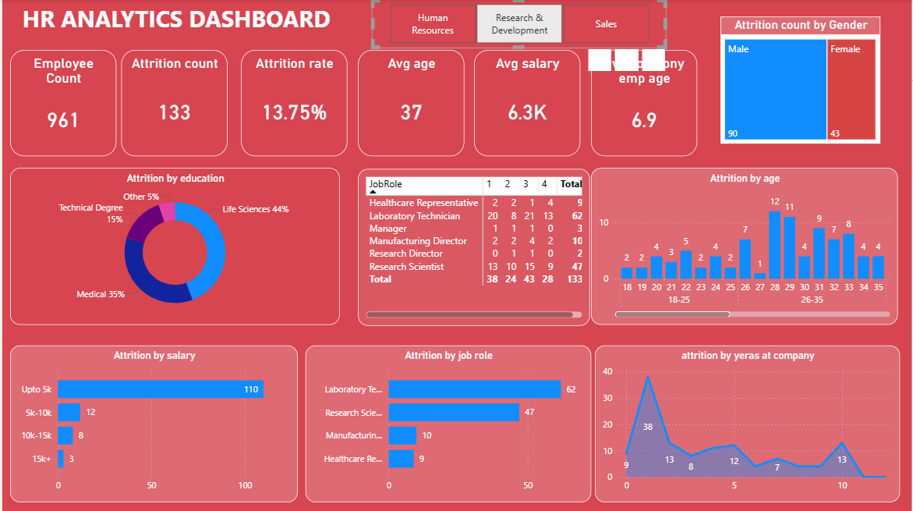

# 📊 HR Analytics Attrition Dashboard (Power BI)

## 📌 Project Overview

This project presents an interactive HR Analytics Dashboard built using Power BI to analyze employee attrition trends.

The dashboard helps identify key factors affecting employee turnover such as salary, age, job role, and experience.

---

## 🎯 Objectives

* Analyze employee attrition patterns
* Identify high-risk job roles and departments
* Understand impact of salary, age, and experience
* Provide data-driven insights for HR decision-making

---

## 📂 Dataset

* HR Employee Dataset (CSV format)
* Includes key features like:

  * Age
  * Gender
  * Salary
  * Department
  * Job Role
  * Education
  * Years at Company
  * Attrition

---

## 📂 Dataset Note

The original dataset contained multiple features.
For this project, only relevant columns related to attrition were used to keep the analysis focused and efficient.

A cleaned/sample dataset is included in this repository.

---

## 📊 Dashboard Features

### 🔢 Key Metrics

* Total Employees: **1470**
* Attrition Count: **238**
* Attrition Rate: **16.08%**
* Average Age: **37**
* Average Salary: **6.5K**
* Average Years at Company: **7**

---

### 📈 Visualizations

* Attrition by Education
* Attrition by Gender
* Attrition by Age Group
* Attrition by Salary Slab
* Attrition by Job Role
* Attrition by Years at Company

---

## 📸 Dashboard Preview

---

## 🔍 Key Insights

* Higher attrition observed in **low salary groups (<5K)**
* **Younger employees (18–30)** have higher attrition
* Roles like **Laboratory Technician and Sales Executive** show higher turnover
* Employees with more years at company tend to stay longer

---

## 🛠 Tools Used

* Power BI
* DAX (Data Analysis Expressions)
* Excel / CSV

---

## 🚀 How to Use

1. Download the `.pbix` file
2. Open in Power BI Desktop
3. Use filters and slicers to explore insights

---

## 💡 Future Improvements

* Add predictive attrition analysis
* Improve dashboard UI/UX
* Add time-based trend analysis

---

## 👤 Author

Srajesh Shetty

